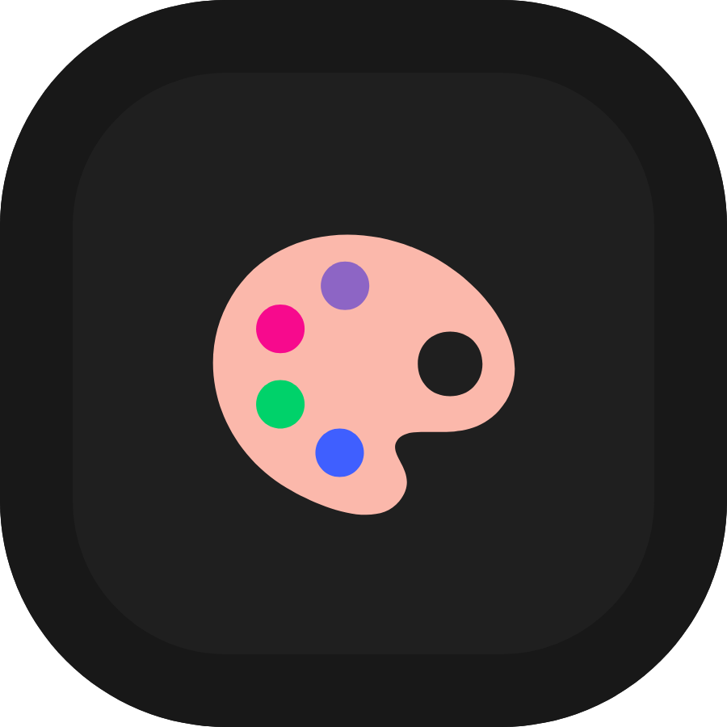
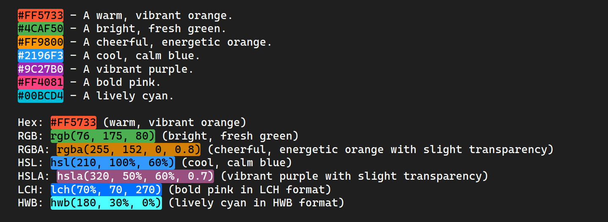

	<h1>Colored</h1>

	

    <a href="https://github.com/Gael-Lopes-Da-Silva/ColoredVSCode">https://github.com/Gael-Lopes-Da-Silva/ColoredVSCode</a>

 

	
	
	

	

Description
------------------------------------------------------------------

Colored is a simple extension that highlight colors in hexadecimal and rgb value. It also support alpha channel for transparency.

Supported color formats
------------------------------------------------------------------

Right now we support the following color formats.
- hexadecimal
- rgb - rgba
- hsl - hsla
- lch
- hwb
- lab

If you want to learn more a web color in general, see [here](https://en.wikipedia.org/wiki/Web_colors).

Options
------------------------------------------------------------------

Colored has 1 command available right now. `Colored: Toggle Hightlight` that turn on or off colors highlighting.

~~~json
{
	"colored.borderRadius": 3, // Raduis of the colors background
	"colored.highlight": true, // Enable or disable highlight of colors
    "colored.maxFileSize": 1000000, // The maximum file size to work with (1mb)
    "colored.maxLineCount": 10000, // The maximum number of line to work with
}
~~~

Screenshots
------------------------------------------------------------------

How to build
------------------------------------------------------------------

If you want a build of Colored you can find it in the release section or in the [build](./build/) folder. Else use `vsce package` in the project folder.

How to install
------------------------------------------------------------------

To install, open visual studio code and go to the extention menu. Click on the three dots and click on `Install from VSIX` and choose the `colored-X.X.X.vsix` file. Or just install it on the market place.